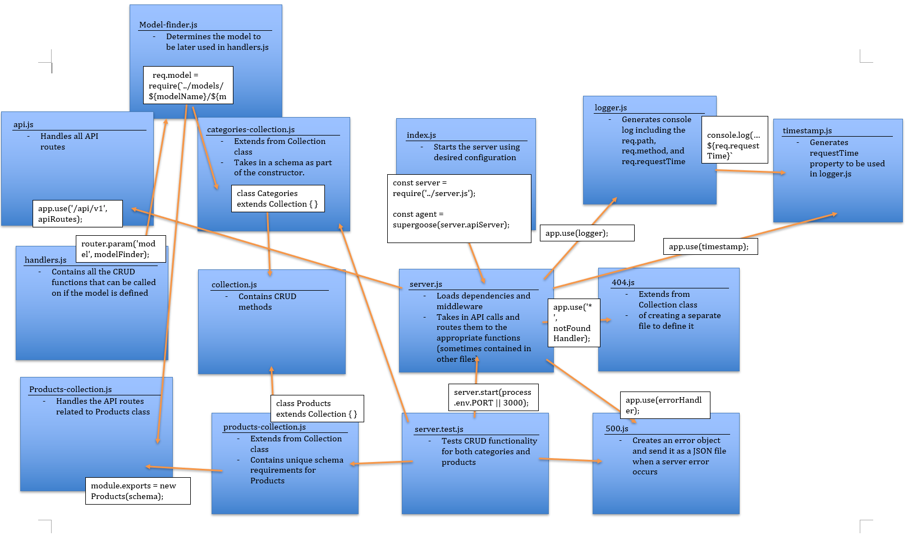

# LAB: API Server (09)

## In this lab, you will be producing a production ready API server with dynamic models

### Author: Earl Jay Caoile

### Links and Resources
* [submission PR](https://github.com/js-401n15-eoc/lab-09/pull/1)
* [GitHub Actions](https://github.com/js-401n15-eoc/lab-09/actions)

#### Documentation
* [MongoDB docs (MongoDB CRUD Operations)](https://docs.mongodb.com/manual/crud/)

### Setup
#### Tests
* Testing command: `npm test` from root directory

#### UML
